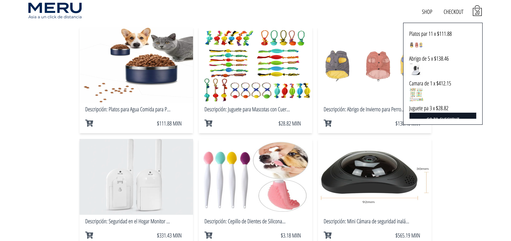

# Frontend Meru Ecommerce Online 🛍



[See the aplication](https://ismaeljdz.github.io/LightDarkMode/) 👀

## Welcome! 👋

\*\* Frontend Technologies 🛠

- HTML5
- CSS3
- JavaScript,
- React,
- Next,
- Redux
- Tailwind

## Pre-requirements 📋

- Node
- Npm

## Run app " Development " ⚙️

```
1.- npm install or yarn install
2.- npm run dev or yarn dev  --Mode development
```
## Run app " Production " 🚀

```
1.- npm run build or yarn build
2.- npm run start or yarn start  --Mode production
```

## Deployment 📦

_add additional notes about how to do deploy_

_Tools I've used in this project_

- [Npm](https://www.npmjs.com/) - Npm
- [React](https://es.reactjs.org/) - React
- [NextJs](https://nextjs.org/) - NextJs
- [Tailwind](https://tailwindcss.com/) - Tailwind

## Author ✒️

_Developed by_

- **Ismael JDz7** - _Frontend-Developer_ - [IsmaelJdz7](https://github.com/IsmaelJDz)

---

⌨️ with ❤️ by [IsmaelJDz7](https://github.com/IsmaelJDz) 😊
